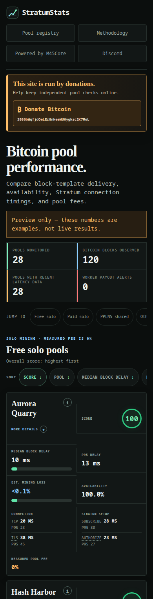

# StratumStats

StratumStats is a dependency-free Go service for measuring observable Bitcoin
mining-pool behavior. It collects Stratum V1 observations as append-only JSONL
and publishes a dashboard covering block-template delivery, availability,
connection timing, TLS, coinbase payouts, and measurable solo-pool fees.




The screenshots use synthetic data and must not be presented as real pool
measurements.

## Features

- Compares template delivery only for the same Bitcoin block and vantage.
- Publishes median and P95 delay, availability, protocol timing, and sample counts.
- Measures solo-pool fees only when the probe worker output is found in coinbase.
- Verifies TLS certificates and reports failures explicitly.
- Keeps raw JSONL evidence independently recomputable.
- Provides regional views and a transparent 0–100 performance score.
- Never submits shares.

## Quick start

Requires Go 1.25.12 or newer and has no third-party Go dependencies.

```bash
# Start a synthetic dashboard at http://localhost:8080.
go run .

# Collect real observations until interrupted.
go run . collect -vantage us-west

# Serve reports from data/observations.jsonl.
go run . serve
```

The dashboard binds to `127.0.0.1:8080` by default. Pass `-addr` explicitly
when it should listen on another interface.

Build a reusable binary with:

```bash
go build -o stratumstats .
```

Pool configuration lives in [`config/pools.json`](config/pools.json). Pass
`-filter-continent` to `collect` to skip known endpoints outside the collector's
continent; global and unlocated endpoints remain enabled.

## Measurement model

StratumStats records observations rather than pool claims. Template latency is
relative to the earliest structurally valid template observed for the same block
and vantage. Median, P95, history, and protocol timings use a rolling 24-hour
window; availability and payout verification remain cumulative.

Protocol measurements include TCP connect, TLS handshake, `mining.subscribe`,
`mining.authorize`, and optional `mining.ping`. Coinbase reconstruction checks
whether the generated worker script is present and redacts that destination
before telemetry is stored. Shared-pool fees are not shown because they cannot
be measured from the block coinbase.

The dashboard's `/methodology` page documents scoring, payout interpretation,
and limitations in detail.

Regional probe ingestion is provided by
[StratumScout](https://github.com/M45Core/StratumScout). Each regional view
compares observations only within the same vantage.

## Production installation

The generic systemd installer supports Debian and Ubuntu. It creates an
unprivileged service account, installs the pool registry, preserves existing
observations and credentials, and enables the service.

```bash
# Optional static build.
./scripts/build-production.sh

# Install the prebuilt binary. Omit --binary to build during installation.
sudo ./scripts/install-production.sh --binary .dist/stratumstats
```

The service listens on `127.0.0.1:8081` and stores observations in
`/var/lib/stratumstats/observations.jsonl`. Review the
[systemd unit](deploy/stratumstats.service) and
[environment example](deploy/stratumstats.env.example) before installing. Use
`--no-start` to install without starting the service.

## HTTP API

- `GET /api/v1/reports` — pool reports
- `GET /api/v1/vantages` — regional sample counts and health
- `GET /api/v1/probe-config` — probe-compatible endpoint configuration
- `GET /api/v1/pools` — configured pool information
- `GET /api/v1/methodology` — metric and scoring metadata
- `GET /healthz` — liveness

`POST /api/v1/ingest` is enabled only when
`STRATUMSTATS_INGEST_KEY_ID` and `STRATUMSTATS_INGEST_SECRET` are set. The secret
must contain at least 32 bytes.

## Development

```bash
go test ./...
go vet ./...
```

Regenerate the synthetic screenshots with:

```bash
./scripts/screenshot.sh
./scripts/screenshot.sh --mobile
```
