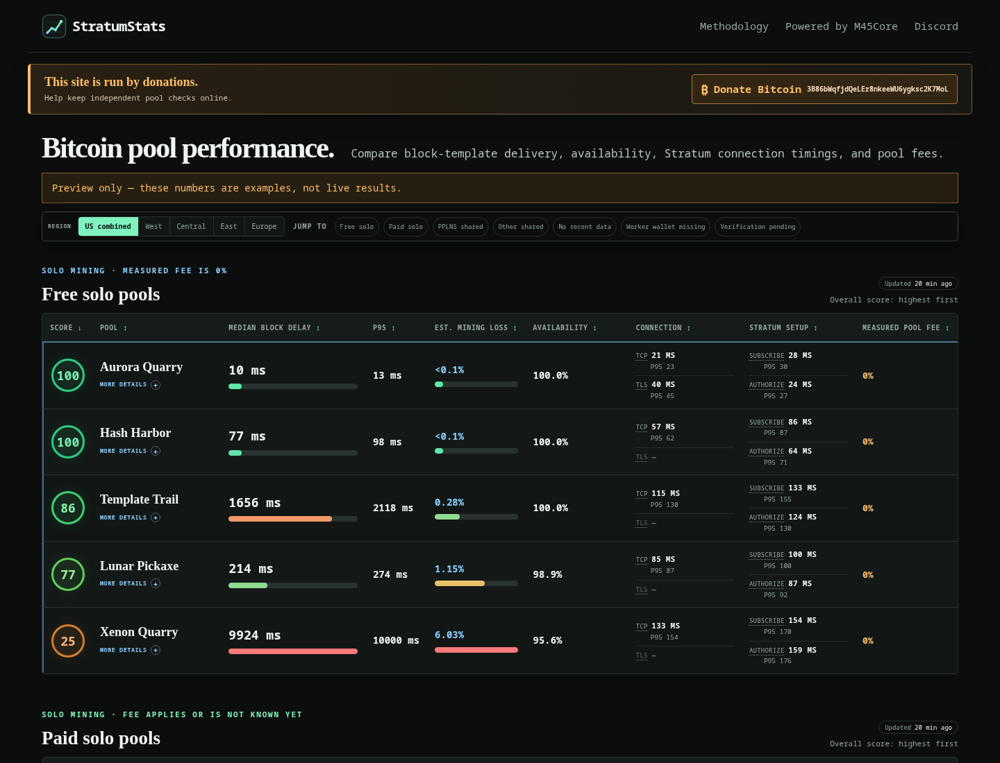

# StratumStats

StratumStats is a Go service for measuring observable Bitcoin mining-pool
behavior. It records Stratum observations as append-only JSONL and publishes
latency, availability, protocol response times, TLS, and sample counts.
Coinbase output observations and solo pool-fee estimates are shown beside those
measurements on the same dashboard. Non-solo rows show explicitly labeled
advertised fee terms from the pool registry because their miner fees are not
observable in the block coinbase.

Reports keep these dimensions separate and do not calculate an overall score
or ranking.

The pool registry is reproducibly seeded from the local `stratum-race` and
`PoolCensus` registries. Endpoints still require ongoing verification. Demo data
is synthetic and must not be published as real pool measurements.



_Regenerate this synthetic dashboard screenshot with `./scripts/screenshot.sh`._

## Principles

- **Measurements over claims.** Reports use automated observations, never paid
  placement, popularity, sponsorship, or operator questionnaires.
- **Metrics stay separate.** Availability, median latency, tail latency,
  protocol response, TLS, sample counts, and coinbase evidence remain
  independent facts even though they share one dashboard.
- **Same block, same vantage.** Delivery delay is compared only for the same
  block observed from the same location, reducing geography and clock bias.
- **Sample size stays visible.** Eligible block and protocol-attempt counts are
  published directly beside their measurements.
- **Raw evidence is canonical.** JSONL is append-only and independently
  recomputable. A future database may index it but will not replace it.
- **Pseudonymous, not magically anonymous.** Connections rotate a valid Bitcoin
  address, worker name, and miner agent. Pools can still observe the probe IP,
  so published vantage labels should be coarse regions.

## Quick start

Requires Go 1.22 or newer and has no third-party Go dependencies.

```bash
# Start a clearly labeled synthetic dashboard at http://localhost:8080.
go run .
```

For real measurements, use the same no-build entry point:

```bash
# Record real block observations until interrupted.
go run . collect -vantage us-west

# Serve reports recomputed from data/observations.jsonl.
go run . serve
```

The dashboard checks for new measurements every 10 seconds without reloading
the page. Changed pool rows briefly flash, and rows are moved or re-sorted when
their verification state or block-template latency changes.

A low-cost, standalone Fly.io probe for sampled US West, Central, and East
measurements is implemented in the separate StratumScout repository and specified
in [`docs/regional-probe-design.md`](docs/regional-probe-design.md). Its live Fly
canary has not yet started, so it is not yet an active data source.
Deployment gates, canary checks, promotion, and rollback are tracked in the
[`regional probe rollout runbook`](docs/regional-probe-rollout.md).

Configuration is in `config/pools.json`. The collector never submits shares.
Current records use observation schema version 8 with retry-safe IDs, source
provenance, bounded non-worker coinbase evidence, and `block_id` terminology.

Compiling a reusable binary is optional:

```bash
go build -o stratumstats .
./stratumstats collect -vantage us-west
```

## Managed Bitcoin Core (optional)

The node helper installs Bitcoin Core 31.1 inside this workspace without `sudo`
or PATH changes. It verifies the official archive against reviewed, pinned
SHA-256 values and configures local cookie-authenticated RPC, no wallet,
outbound-only peers, and pruning.

```bash
./scripts/bitcoin-node.sh install
./scripts/bitcoin-node.sh start
./scripts/bitcoin-node.sh status
./scripts/bitcoin-node.sh logs --follow
./scripts/bitcoin-node.sh stop
```

The binaries, manager state, and default chain data live under `.bitcoin-node/`,
which is ignored by Git. Shutdown uses the Bitcoin Core RPC and never
force-kills the process. `./scripts/bitcoin-node.sh paths` shows the active
locations.

To keep chain data on another mounted drive, mount it and create a dedicated
empty directory first. The manager deliberately refuses to create a missing
external path:

```bash
./scripts/bitcoin-node.sh install --data-dir /mnt/bitcoin-ssd/stratumstats-node
```

The choice is remembered for later commands. If that drive disappears, the
manager stops with a mount reminder instead of silently creating a replacement
directory on another disk. It also refuses to take over a non-empty directory
it did not initialize.

The managed config is copied from `config/bitcoin.conf` on first setup. Its
`prune=10000` target retains roughly 10 GiB of block and undo files; it is not a
cap on total node storage or initial-sync traffic. Initial sync still downloads
and validates the complete chain, which the [official download page](https://bitcoincore.org/en/download/)
currently estimates at about 600 GB. For an archival node, remove the `prune`
line from the selected data directory before the first start. A node is ready
for comparisons only when `status` reports `initialblockdownload: false`.

To become usable near the network tip before historical validation finishes,
load a local [AssumeUTXO](https://github.com/bitcoin/bitcoin/blob/v31.1/doc/assumeutxo.md)
snapshot after the node has synchronized headers through the snapshot base
height:

```bash
./scripts/bitcoin-node.sh start
./scripts/bitcoin-node.sh fast-sync /path/to/utxo-935000.dat
./scripts/bitcoin-node.sh status
```

Bitcoin Core has no canonical snapshot download source. Obtain one from a node
you control or a source you choose; `fast-sync` passes it to `loadtxoutset`,
which rejects any UTXO set whose hash and base height do not match commitments
compiled into Bitcoin Core 31.1. This release recognizes mainnet snapshots at
heights 840,000, 880,000, 910,000, and 935,000. The newest recognized height
usually reaches the tip fastest.

AssumeUTXO accelerates availability, not full verification or total download
traffic. Core synchronizes the snapshot chain to the tip first, then continues
the normal genesis-to-snapshot validation in the background. `status` displays
both chainstates. After `fast-sync` succeeds, the original snapshot file is no
longer needed and may be removed manually.

This helper manages Bitcoin Core lifecycle now; automatic RPC/ZMQ corroboration
inside the collector remains a later integration step.

## Published pool report

The deterministic aggregation is implemented in `internal/report/report.go`.

| Field | Meaning |
|---|---|
| Bitcoin blocks observed | Distinct Bitcoin block identifiers in the dataset; one block counts once regardless of how many pools report it |
| Eligible samples | Unique vantage-and-block pairs for which the pool was connected at observation start |
| Availability | Observed valid arrivals divided by eligible vantage-and-block samples |
| Median block-template latency | Median delay behind the earliest structurally valid template for the same block and vantage, using the rolling 24-hour window |
| P95 block-template latency | 95th-percentile relative delay from the same rolling 24-hour window, exposing intermittent stalls |
| Estimated mining loss | Median relative latency ÷ 600,000 ms × 100; an incremental stale-work proxy, not measured revenue loss |
| Latest payout destinations | Retained positive-value non-worker coinbase outputs with address or script type, satoshi value, and total-value percentage |
| Recent metric history | Up to the last 12 canonical template-latency samples within the rolling 24-hour window plus worker-matched fee samples for solo pools; non-solo panels show advertised product terms |
| TLS | Whether a configured TLS Stratum endpoint completed a measured session with a certificate valid for its hostname, validity period, and the probe system trust store; certificate failures are explicit errors |

For each block and vantage, reports use only the earliest collector window.
Block-template median, P95, estimated mining loss, recent latency history, and
protocol timing statistics use observations from the rolling 24 hours before
report generation. Report JSON includes `latency_window_hours: 24` so API
consumers can apply the same interpretation. Availability and payout verification remain cumulative.
Late jobs cannot reopen a finalized block or create additional zero-latency
baselines.

The dashboard sorts each section by median block-template latency. Solo pools
use three sections: Free solo pools, Non-free solo pools, and Unsafe solo pools. Free requires
sampled coinbases to consistently contain the generated worker address and the
latest observed effective pool fee to be 0.00%. Non-free has the same worker-output
requirement but a nonzero or not-yet-measured fee. Absent, varied, and
not-yet-verified worker output entries remain in Unsafe. Any non-solo product record whose researched product list includes PPLNS appears in Pools offering PPLNS, whether PPLNS is dedicated or one of several payout modes. Remaining non-solo pools appear in Other non-solo pools. JSON API reports retain deterministic
alphabetical ordering. Pools without an observed block-template latency sample
are omitted from every dashboard section. Each displayed section can be sorted in either direction by any column; missing values remain last. Every pool row has an expandable Payout & history panel. Solo panels include destination percentages and recent latency line graph and timestamped observed-fee changes. Non-solo panels label decoded block coinbase destinations separately from later miner payouts and show advertised fee terms instead of an inapplicable measured-fee state.

## Protocol response timings

Protocol operations are stored as independent version 8 JSONL records rather
than repeated on every block observation. Reports publish successful-operation
median and P95 durations plus outcome counts for:

- TCP connect, including local name resolution;
- TLS 1.2+ handshake with hostname, validity-period, chain, and system-trust-store certificate verification on TLS endpoints;
- `mining.subscribe`;
- `mining.authorize`; and
- `mining.ping` / `pong`.

`mining.ping` is an optional Stratum V1 extension. Unsupported responses and
timeouts are reported as compatibility facts, not availability failures. A
supported session may be sampled again every 60 seconds. Raw records retain the
endpoint, coarse vantage, duration, response status, and error category.
Certificate verification is never bypassed. A failed check is retained as
`tls_certificate_invalid`, counted in `certificate_errors`, and rendered as a
red TLS error even if another TLS endpoint for the pool succeeds.

## Empty templates

Empty-first frequency is retained only as raw evidence and is not displayed or
used as a judgment. After a new block, Bitcoin Core must validate the block and
rebuild transaction state. A structurally valid coinbase-only template still
lets miners stop working on the stale parent immediately, so it counts as the
first block-template arrival without waiting for transaction branches.

## Coinbase output observations

The probe reconstructs each structurally valid coinbase using its negotiated
extranonces and checks for the exact generated worker address script. The main
dashboard uses this evidence to determine list placement without spending a
separate column on it. Normal requires the worker address in every decoded
sample. Missing, varied, and no-data entries appear in Unsafe until positive
evidence is available.

These are output-presence observations, not pool types or judgments about
payment correctness. A pool can account for earnings outside the coinbase
transaction.

For a solo job where the worker output is present, the observed effective fee is:

```text
100 × (all coinbase outputs − worker outputs) / all coinbase outputs
```

Optional donations and configured payout splits can be included in this
effective percentage. No fee is inferred from a job where the worker address is
absent. This calculation does not measure PPLNS, FPPS, or other shared-pool fees because those pools account for shares and pay miners separately from the block coinbase. Their dashboard rows instead show operator-advertised terms from the registry, with a check date when available; an absent sourced term is labeled advertised fee not confirmed. Payment correctness cannot be inferred from Stratum alone; it needs a controlled hashrate/payment study.

Current version 8 JSONL retains `coinbase_analyzed`,
`worker_wallet_in_coinbase`, `coinbase_total_sats`, `worker_payout_sats`,
`estimated_pool_fee_pct`, and up to 64 coalesced positive-value non-worker
coinbase destinations. The matched worker destination is reduced to aggregate
verification and payout values inside the probe; its address and script are
removed before telemetry serialization or storage. Oversized non-worker output
scripts retain a marked 80-byte prefix; smaller destinations beyond the cap are
represented by an omitted-value total. Decoded standard mainnet non-worker
addresses link to their mempool.space address pages; script-only destinations
remain plain text. Reports expose the latest destination values and percentages,
recent template-latency and
fee series, worker-address status, fee samples and change counts, and the latest
change time. Consecutive fee samples are compared at the displayed 0.01%
precision; the dashboard explicitly shows stable or previous → current instead
of hiding changes in a median.

## Job verification

The collector currently performs:

1. strict `mining.notify` field and hex-length checks;
2. compact proof-of-work target sanity checks;
3. coinbase reconstruction with negotiated extranonces;
4. legacy and witness coinbase transaction parsing;
5. worker payout-script matching and output accounting;
6. merkle-root reconstruction from supplied branches;
7. clean-job and previous-hash transition checks.

Stratum V1 does not provide transaction bodies in `mining.notify`, so a passive
client can structurally verify work but cannot independently validate every
transaction. Optional Bitcoin Core RPC/ZMQ comparison is the next authoritative
verification layer.

## Pool registry

The generated `config/pools.json` is enriched by the manually researched
`config/pool-metadata.json`. The current registry contains 36 distinct pool or
product records after regional and duplicate aliases are consolidated.

Context kept separate from telemetry includes:

- canonical pool and operator names;
- `solo`, `shared`, `hybrid`, or `decentralized` type;
- researched operating status and collector compatibility;
- advertised products and fee text with a check date;
- separate records when one operator exposes independently selectable measured products;
- endpoint regions/roles and direct research-source links.

The complete research method, decisions, and per-pool summary are in
[`docs/pool-registry.md`](docs/pool-registry.md). The dashboard exposes the same
context at `/pools`; none of it changes measured reports.

Regenerate the combined registry with:

```bash
./scripts/merge-pools.sh
```

The merge combines `stratum-race`, `PoolCensus`, and the research layer, applies
canonical aliases, excludes stale unsupported imports, replaces researched
endpoint sets, and deduplicates normalized host/port/TLS tuples.

## HTTP API

- `GET /api/v1/reports` — current pool reports and disclosures
- `GET /api/v1/reports?vantage=us-west` — one scheduled regional view
- `GET /api/v1/vantages` — regional sample counts and collector health
- `GET /api/v1/probe-config` — minimal compatible endpoint configuration
- `GET /api/v1/pools` — researched pool identity, type, status, terms, endpoints, and sources
- `GET /api/v1/methodology` — published metric names and methodology version
- `GET /healthz` — liveness

`POST /api/v1/ingest` is registered only when both
`STRATUMSTATS_INGEST_KEY_ID` and `STRATUMSTATS_INGEST_SECRET` are set for a
non-demo server. The secret must contain at least 32 bytes. Requests use the
versioned, gzip-compressed HMAC-SHA256 contract documented in
[`docs/regional-probe-design.md`](docs/regional-probe-design.md); unauthenticated,
stale, malformed, and partially invalid batches are rejected before append.
